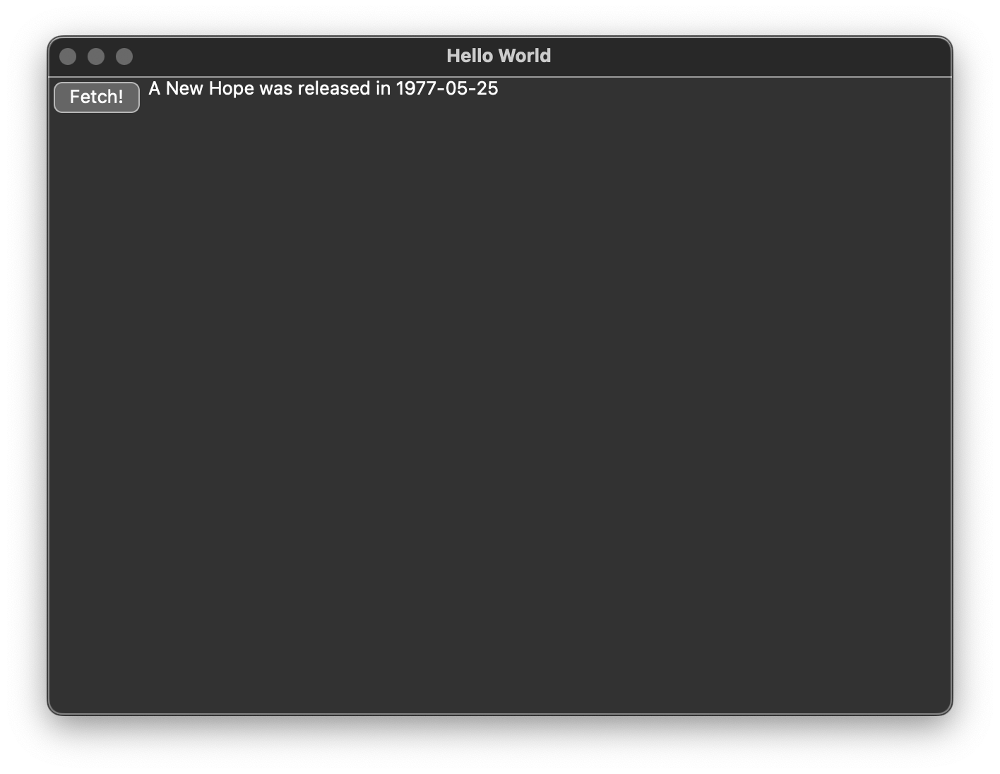
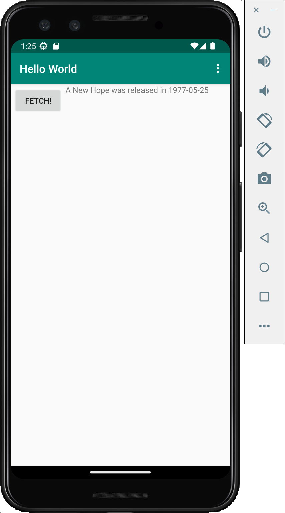

# Beeware crash loading `pydantic_core` on Android

The purpose of this repo is to provide a reproducible sample project for a bug in an Android app created using [Beeware briefcase](https://github.com/beeware/briefcase).

## Summary

The application, it if worked, would fetch data from a graphql endpoint and display it on the screen. It uses the [pydantic](https://pypi.org/project/pydantic/) library when doing graphql queries.

The `briefcase build android` command doesn't seem to package the [pydantic_core](https://pypi.org/project/pydantic-core/) library inside the app, which causes app crashes at runtime, on app startup.

## Environment
* Build machine: MacOS Sonoma 14.1, Intel chip.
* Python 3.11.6
* Android devices tested: 
  - Genymotion Cloud emulator, Android 11, x86_64.
  - Google Android emulator: Pixel 3, Android 11, x86_64.
  - Samsung Galaxy S10+, Android 13.

## Steps to reproduce the issue
* Install requirements: `pip install -r requirements.txt`
* Go into the `helloworld` subdirectory: `cd helloworld`
* Run the app on your local computer: `briefcase dev`
* Click on the "Fetch!" button
  - Verify that the screen displays "A New Hope was released in 1977-05-25"
    
* Run the app on an Android device/emulator:
  - `briefcase create android`
  - `briefcase build android`
  - Start and Android emulator, or connect an Android device to your computer.
  - `adb install -r build/helloworld/android/gradle/app/build/outputs/apk/debug/app-debug.apk`
  - Start to capture android logs: `adb lolcat -v threadtime > /tmp/logcat.txt 2>&1 &`
  - Launch the app.
  - Expected behavior: the app ui appears:

    
  - Actual behavior: the app crashes. The following appears in `/tmp/logcat.txt`:
    ```
    11-18 22:46:32.665  5171  5171 D AndroidRuntime: Shutting down VM
    11-18 22:46:32.667  5171  5171 E AndroidRuntime: FATAL EXCEPTION: main
    11-18 22:46:32.667  5171  5171 E AndroidRuntime: Process: com.example.helloworld, PID: 5171
    11-18 22:46:32.667  5171  5171 E AndroidRuntime: java.lang.RuntimeException: Unable to start activity ComponentInfo{com.example.helloworld/org.beeware.android.MainActivity}: com.chaquo.python.PyException: ModuleNotFoundError: No module named 'pydantic_core._pydantic_core'
    11-18 22:46:32.667  5171  5171 E AndroidRuntime: 	at android.app.ActivityThread.performLaunchActivity(ActivityThread.java:3676)
    11-18 22:46:32.667  5171  5171 E AndroidRuntime: 	at android.app.ActivityThread.handleLaunchActivity(ActivityThread.java:3813)
    11-18 22:46:32.667  5171  5171 E AndroidRuntime: 	at android.app.servertransaction.LaunchActivityItem.execute(LaunchActivityItem.java:101)
    11-18 22:46:32.667  5171  5171 E AndroidRuntime: 	at android.app.servertransaction.TransactionExecutor.executeCallbacks(TransactionExecutor.java:135)
    11-18 22:46:32.667  5171  5171 E AndroidRuntime: 	at android.app.servertransaction.TransactionExecutor.execute(TransactionExecutor.java:95)
    11-18 22:46:32.667  5171  5171 E AndroidRuntime: 	at android.app.ActivityThread$H.handleMessage(ActivityThread.java:2308)
    11-18 22:46:32.667  5171  5171 E AndroidRuntime: 	at android.os.Handler.dispatchMessage(Handler.java:106)
    11-18 22:46:32.667  5171  5171 E AndroidRuntime: 	at android.os.Looper.loopOnce(Looper.java:201)
    11-18 22:46:32.667  5171  5171 E AndroidRuntime: 	at android.os.Looper.loop(Looper.java:288)
    11-18 22:46:32.667  5171  5171 E AndroidRuntime: 	at android.app.ActivityThread.main(ActivityThread.java:7898)
    11-18 22:46:32.667  5171  5171 E AndroidRuntime: 	at java.lang.reflect.Method.invoke(Native Method)
    11-18 22:46:32.667  5171  5171 E AndroidRuntime: 	at com.android.internal.os.RuntimeInit$MethodAndArgsCaller.run(RuntimeInit.java:548)
    11-18 22:46:32.667  5171  5171 E AndroidRuntime: 	at com.android.internal.os.ZygoteInit.main(ZygoteInit.java:936)
    11-18 22:46:32.667  5171  5171 E AndroidRuntime: Caused by: com.chaquo.python.PyException: ModuleNotFoundError: No module named 'pydantic_core._pydantic_core'
    11-18 22:46:32.667  5171  5171 E AndroidRuntime: 	at <python>.java.chaquopy.import_override(import.pxi:20)
    11-18 22:46:32.667  5171  5171 E AndroidRuntime: 	at <python>.java.chaquopy.import_override(import.pxi:60)
    11-18 22:46:32.667  5171  5171 E AndroidRuntime: 	at <python>.pydantic_core.<module>(__init__.py:6)
    11-18 22:46:32.667  5171  5171 E AndroidRuntime: 	at <python>.java.chaquopy.import_override(import.pxi:60)
    11-18 22:46:32.667  5171  5171 E AndroidRuntime: 	at <python>.pydantic.main.<module>(main.py:11)
    11-18 22:46:32.667  5171  5171 E AndroidRuntime: 	at <python>.java.android.importer.exec_module(importer.py:554)
    11-18 22:46:32.667  5171  5171 E AndroidRuntime: 	at <python>.java.android.importer.exec_module(importer.py:606)
    11-18 22:46:32.667  5171  5171 E AndroidRuntime: 	at <python>.importlib.import_module(__init__.py:126)
    11-18 22:46:32.667  5171  5171 E AndroidRuntime: 	at <python>.pydantic.__getattr__(__init__.py:372)
    11-18 22:46:32.667  5171  5171 E AndroidRuntime: 	at <python>.java.chaquopy.import_override(import.pxi:60)
    11-18 22:46:32.667  5171  5171 E AndroidRuntime: 	at <python>.graphql_client.async_base_client.<module>(async_base_client.py:9)
    11-18 22:46:32.667  5171  5171 E AndroidRuntime: 	at <python>.java.chaquopy.import_override(import.pxi:60)
    11-18 22:46:32.667  5171  5171 E AndroidRuntime: 	at <python>.graphql_client.<module>(__init__.py:3)
    11-18 22:46:32.667  5171  5171 E AndroidRuntime: 	at <python>.java.chaquopy.import_override(import.pxi:60)
    11-18 22:46:32.667  5171  5171 E AndroidRuntime: 	at <python>.helloworld.app.<module>(app.py:7)
    11-18 22:46:32.667  5171  5171 E AndroidRuntime: 	at <python>.java.chaquopy.import_override(import.pxi:60)
    11-18 22:46:32.667  5171  5171 E AndroidRuntime: 	at <python>.__main__.<module>(__main__.py:1)
    11-18 22:46:32.667  5171  5171 E AndroidRuntime: 	at <python>.runpy._run_code(<frozen runpy>:88)
    11-18 22:46:32.667  5171  5171 E AndroidRuntime: 	at <python>.runpy._run_module_code(<frozen runpy>:98)
    11-18 22:46:32.667  5171  5171 E AndroidRuntime: 	at <python>.runpy.run_module(<frozen runpy>:226)
    11-18 22:46:32.667  5171  5171 E AndroidRuntime: 	at <python>.chaquopy_java.call(chaquopy_java.pyx:354)
    11-18 22:46:32.667  5171  5171 E AndroidRuntime: 	at <python>.chaquopy_java.Java_com_chaquo_python_PyObject_callAttrThrowsNative(chaquopy_java.pyx:326)
    11-18 22:46:32.667  5171  5171 E AndroidRuntime: 	at com.chaquo.python.PyObject.callAttrThrowsNative(Native Method)
    11-18 22:46:32.667  5171  5171 E AndroidRuntime: 	at com.chaquo.python.PyObject.callAttrThrows(PyObject.java:232)
    11-18 22:46:32.667  5171  5171 E AndroidRuntime: 	at com.chaquo.python.PyObject.callAttr(PyObject.java:221)
    11-18 22:46:32.667  5171  5171 E AndroidRuntime: 	at org.beeware.android.MainActivity.onCreate(MainActivity.java:85)
    11-18 22:46:32.667  5171  5171 E AndroidRuntime: 	at android.app.Activity.performCreate(Activity.java:8290)
    11-18 22:46:32.667  5171  5171 E AndroidRuntime: 	at android.app.Activity.performCreate(Activity.java:8269)
    11-18 22:46:32.667  5171  5171 E AndroidRuntime: 	at android.app.Instrumentation.callActivityOnCreate(Instrumentation.java:1384)
    11-18 22:46:32.667  5171  5171 E AndroidRuntime: 	at android.app.ActivityThread.performLaunchActivity(ActivityThread.java:3657)
    11-18 22:46:32.667  5171  5171 E AndroidRuntime: 	... 12 more
    ```

## Analysis
The `briefcase build android` command shows that the `whl` file for `pyndantic_core` which is being pulled in is the macosx build:
```
> Task :app:generateDebugPythonRequirements
Chaquopy: Installing for arm64-v8a
Looking in indexes: https://pypi.org/simple, https://chaquo.com/pypi-7.0, https://chaquo.com/pypi-13.1
Collecting httpx==0.25.1
  Using cached httpx-0.25.1-py3-none-any.whl (75 kB)
Collecting pydantic==2.5.1
  Using cached pydantic-2.5.1-py3-none-any.whl (381 kB)
Processing /Users/calvarez/Library/Caches/chaquopy/pip/wheels/1d/34/7f/10cb7aee78f14a7b936afe80adf1df7a63a70a549ce8b40ce1/pydantic_core-2.14.3-cp311-cp311-macosx_10_7_x86_64.whl
```

I guess the correct behavior would be to download or build the whl appropriate for the Android platform.
## Additional information:

Note that all the files in `helloworld/src/graphql_client` were generated by [ariadne-codegen](https://github.com/mirumee/ariadne-codegen) and are unmodified.
